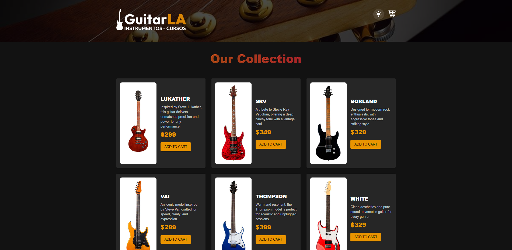
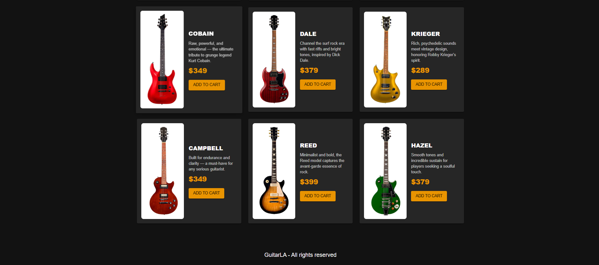

# 🎸 GuitarLA - React + TypeScript + useReducer

A modern e-commerce guitar catalog built with **React**, **TypeScript**, and
**Material UI**, featuring a dynamic shopping cart powered by `useReducer`. This
project demonstrates responsive UI design, state management, theming with
light/dark mode, and scalable architecture with reusable components.



---

## 🚀 Features

- 🛒 **Add/Remove guitars from cart**
- 🔢 **Increase/Decrease quantity**
- 🎨 **Light/Dark mode toggle**
- ⚛️ **State managed with useReducer**
- 🧱 **Built with Material UI**
- 💾 **Cart persisted in localStorage**
- 📱 **Fully responsive design**
- 🧠 **Strictly typed with TypeScript**

---

## 🖥️ Tech Stack

- **React** 18
- **TypeScript**
- **Material UI (MUI)**
- **useReducer for state management**
- **CSS modules**
- **Vite** for blazing-fast builds

---

## 📂 Project Structure

├── public │ └── img/ # Static assets (guitars, logo, screenshots) ├── src │ ├──
components/ # Reusable UI components (Header, Guitar card) │ ├── data/ # Static
guitar data (db.ts) │ ├── reducers/ # Cart reducer logic │ ├── types/ #
TypeScript types (Guitar, CartItem) │ ├── App.tsx # Main component with cart
logic │ ├── main.tsx # ThemeProvider and app mounting │ ├── theme.ts #
Light/Dark mode configuration │ └── index.css # Custom styles

---

## 🧪 Demo

> Try the live version (optional):  
> 🔗
> [https://your-deployment-url.vercel.app](https://guitarla-ecommerce-app.netlify.app/)

---

## 📸 Screenshots

### 🖼️ Main UI


### 🧺 Cart Interaction



---

## 🧠 What I learned

- How to build reusable and scalable components in React with TypeScript
- Applying the `useReducer` pattern for complex state management
- Creating responsive and theme-aware UI with Material UI
- Persisting application state via `localStorage`
- Structuring a project for real-world maintainability

---

## 💡 Bonus

- Custom gradient headers with `WebkitTextFillColor: transparent`
- Animations using pure CSS (`@keyframes`)
- Fully accessible and keyboard-navigable components

---

## 🧑‍💻 Author

**Guille Varela Barros** – [LinkedIn](www.linkedin.com/in/guillevarelabarros) |
[Github](https://github.com/guillevarelabarros)

If you liked this project, please ⭐ it and feel free to connect!

---

## 📦 Installation & Setup

```bash
# Clone the repository
git clone https://github.com/yourusername/guitarla-ts-usereducer.git
cd guitarla-ts-usereducer

# Install dependencies
yarn install

# Start development server
yarn dev

```
